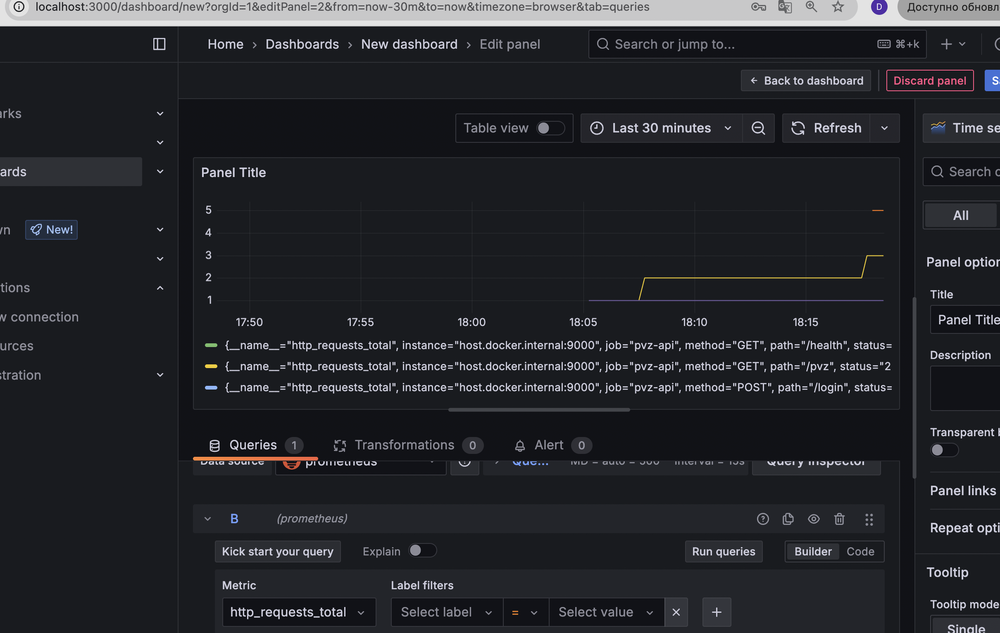

# Prometheus метрики

Эта конфигурация позволяет мониторить локально запущенную API.

В проекте реализован сбор метрик с помощью Prometheus. Метрики доступны на порту
`9000` по пути `/metrics`.

## Доступные метрики

Система собирает следующие метрики:

1. **http_requests_total** - счетчик всех HTTP запросов
   - Labels: `method`, `path`, `status`
   - Пример: `http_requests_total{method="GET",path="/pvz",status="200"}`

2. **http_request_duration_seconds** - гистограмма времени ответа на запросы
   - Labels: `method`, `path`, `status`
   - Пример:
     `http_request_duration_seconds_bucket{method="POST",path="/login",status="200",le="0.1"}`

## Проверка метрик

### С помощью curl

```bash
# Проверка доступности метрик
curl http://localhost:9000/metrics

# Фильтрация определенных метрик
curl http://localhost:9000/metrics | grep http_requests_total
```

### Тест нагрузки и мониторинг

1. Сделайте несколько запросов к API для создания метрик:

```bash
# Регистрация пользователя
curl -X POST http://localhost:8080/register \
  -H "Content-Type: application/json" \
  -d '{"email":"test@example.com","password":"password123","role":"employee"}'

# Вход в систему
curl -X POST http://localhost:8080/login \
  -H "Content-Type: application/json" \
  -d '{"email":"test@example.com","password":"password123"}'
```

2. Проверьте обновленные метрики:

```bash
curl http://localhost:9000/metrics | grep http_requests_total
```

## Настройка Prometheus

Для подключения к этим метрикам настройте Prometheus с конфигурацией,
аналогичной следующей:

```yaml
scrape_configs:
  - job_name: "pvz-api"
    scrape_interval: 5s
    static_configs:
      - targets: ["localhost:9000"]
```

## Графики в Grafana

Примеры дашбордов для Grafana:

1. **Счетчик запросов по статусам**:
   - Метрика: `sum(rate(http_requests_total[5m])) by (status)`
   - Тип: Counter
   - Отображение: Bar Chart

2. **Среднее время ответа**:
   - Метрика:
     `rate(http_request_duration_seconds_sum[5m]) / rate(http_request_duration_seconds_count[5m])`
   - Тип: Gauge
   - Отображение: Gauge или Time Series

3. **Распределение времени ответа**:
   - Метрика:
     `histogram_quantile(0.95, sum(rate(http_request_duration_seconds_bucket[5m])) by (le))`
   - Тип: Gauge
   - Отображение: Time Series

### Пример Grafana дашборда



## Запуск Prometheus и Grafana в Docker

Для удобства тестирования можно использовать Docker Compose:

```yaml
version: "3"
services:
  prometheus:
    image: prom/prometheus
    volumes:
      - ./prometheus.yml:/etc/prometheus/prometheus.yml
    ports:
      - "9090:9090"
    extra_hosts:
      - "host.docker.internal:host-gateway"

  grafana:
    image: grafana/grafana
    ports:
      - "3000:3000"
    depends_on:
      - prometheus
```

Где `prometheus.yml` содержит:

```yaml
global:
  scrape_interval: 15s

scrape_configs:
  - job_name: "pvz-api"
    scrape_interval: 5s
    static_configs:
      - targets: ["host.docker.internal:9000"]
```
